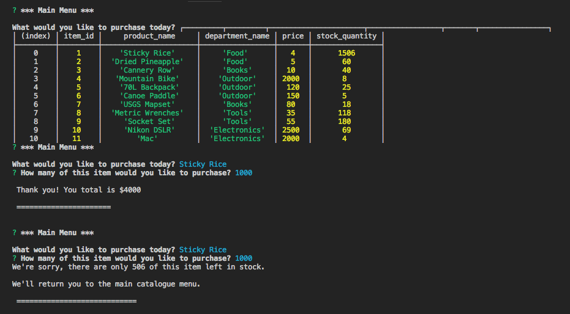

# Bamazon
Bamazon is a mock catalogue demonstration app system that interacts with an SQL database through a terminal interface. Bamazon uses the mysql and inquirer npm modules to interact with the database and the user. The system uses two apps- one for 'front end' customer interactions, and one for 'backend' manager tools.

Once launched, the bamazonCustomer app will display the current catalogue and promopt the user to input their purchase choice. Once the user inputs their choice, they will be prompted to enter the quantity of the item to purhcase. Then, the customer will be shown their total and taken back to the main menu. The item inventory will be updated in the database. However, if there is not enough of the product in stock, the user will be informed and shown the current inventory. They will then be taken back to the main menu.

For the manager app, the user will be shown the following menu when launched. Managers can:
* ## View Products for Sale- See all current inventory
* ## View Low Inventory- see all items with stock of less than 20

* ## Add to Inventory- add inventory to any currently stocked item

* ## Add New Product- create new product that is then pushed to the database

## Or select Exit to end the connection/ program.